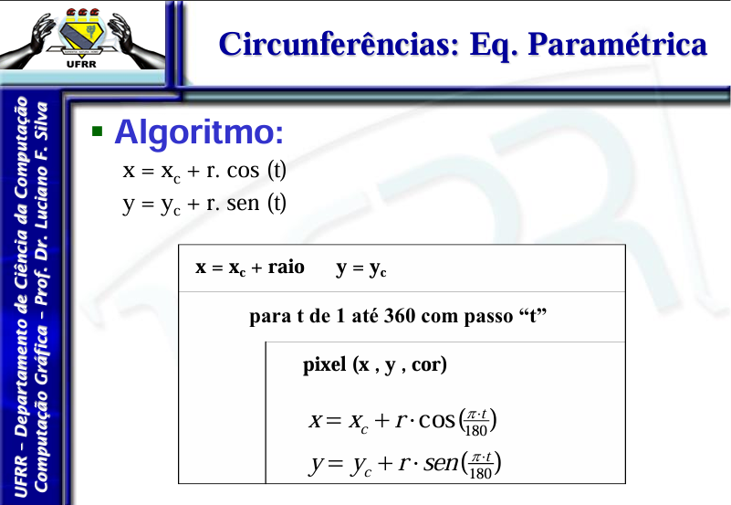
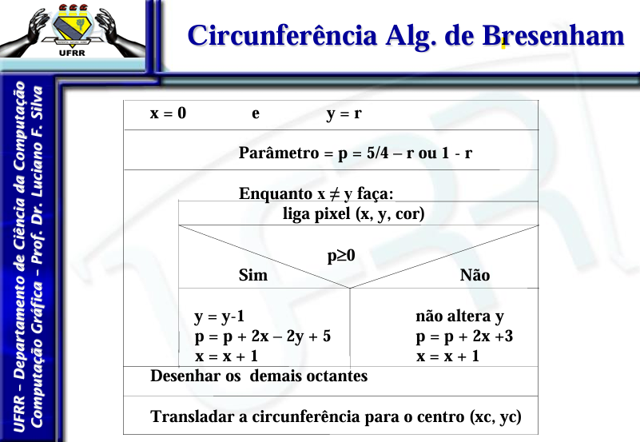

# Trabalho de rasterização de Circunferência

## Objetivo do programa

### Desenvolver um programa que permita desenhar circunferências por meio dos algoritmos:

- paramétrico;
- incremental;
- Bresenham.

## Tecnologias utilizadas

### Linguagem de programação: 

Escolhi como linguagem para realizar esse trabalho o ```python``` a escolha foi devido a maior familiaridade com a linguem visando uma melhor implementação do código.

### Blibiotecas utilizadas:

Para esse codigo utilizei duas blibiotecas: 

- ```sys```: Dentro do codigo foi utilizada para encerrar o programa corretamente;

- ```pygame```: Essa foi usada pra conseguir demonstrar graficamente a implementação. Estava na duvida dentre ela e a mathplot, mas ela foi a escolhida visando facilitar futuras implementações no decorrer da disciplina.

- ```math```: Pra conseguir facilitar os calculos das circunferências usei a blibioteca ```math``` isso possibilitou que não precissase realizar algumas operações completas dentro dos algoritimos 

## Implementação

Assim como no arquivo das linhas foi implementado os 3 algoritimos dentro de um mesmo aquivo para ficar mais facil de apresentar a ideia do programa, diante disso vamos falar sobre eles a seguir: 


### paramétrico:  

Para a realização da primeira função implementada no codigo como ```circulo_parametrico```, essa função tem 3 entradas principais ```xc```, ```yc``` e ```raio```. Para a realização do algoritimo eu fiz com referencia ao Slide disponibilizado pelo Professor durante as aulas da disciplina: 



### incremental: 

Para a realização da primeira função implementada no codigo como ```circulo_parametrico```, essa função tem 3 entradas principais ```xc```, ```yc``` e ```raio```. (referenciar essa parte direito.): 


### Bresenham: 

Para a realização da primeira função implementada no codigo como ```circulo_bresenham```, essa função tem 3 entradas principais ```xc```, ```yc``` e ```raio```. Para a realização do algoritimo eu fiz com referencia ao Slide disponibilizado pelo Professor durante as aulas da disciplina: 



### Desenvolvimento:

Para esse desenvolvimento dos algoritimos de circunferencia eu enfrentei alguns problemas de implementação, fiz ele inicialmente junto com o de linha, mas não gostei da abordagem e após algum tempo fiz o de linha primeiro e depois fiz esses de circunferencia, passada a confusão inicial da resposta gráfica que enfrentei fazendo os algoritimos em linha a parte que mais me levou tempo foi a função ```simetria``` que como o proprio nome deixa implicito serve para orcanicar a simetria das circunferencias, a função incremental foi algo que me levou um pouco mais de tempo pois precisava encontrar mais referencia para desenvolve-la. Acredito ter conseguido implementar os topicos solicitados na atividade.