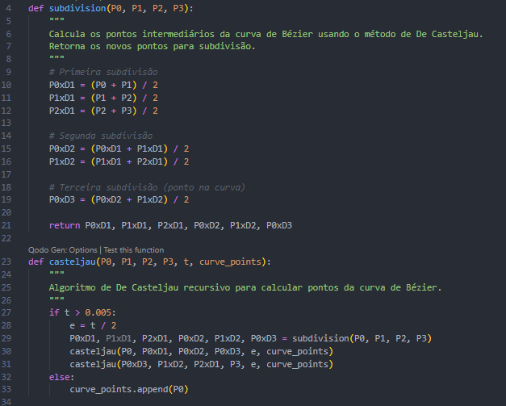

Aluno: Rosialdo Vicente

N° de Matricula: 2020018122

## Objetivo do Programa

### Desenvolver um programa para desenhar curvas aproximadas utilizando os algoritmos:

- **Bézier**
- **De Casteljau**

## Tecnologias Utilizadas

### Linguagem de Programação

Para a implementação deste trabalho, optei pela linguagem `Python` devido à sua flexibilidade e à minha familiaridade com seu uso no desenvolvimento de aplicações gráficas.

### Bibliotecas Utilizadas

As seguintes bibliotecas foram utilizadas no projeto:

- **`pygame`**: Escolhida por já ter sido utilizada em trabalhos anteriores, facilitando a implementação e visualização gráfica das curvas.
- **`math`**: Utilizada para cálculos matemáticos necessários no algoritmo de Bézier, incluindo o cálculo do fatorial para o Binômio de Newton.

## Implementação dos Algoritmos

Cada algoritmo foi implementado em arquivos separados para facilitar o entendimento e organização do código.

### Algoritmo Beziér:

No algoritmo de Bézier, o cálculo da curva é feito através do **Binômio de Newton** e dos **polinômios de Bernstein**, que determinam a influência de cada ponto de controle ao longo da curva. O coeficiente calculado é aplicado às coordenadas **X e Y**, sendo somado aos respectivos valores e retornado ao final do processamento.

Abaixo, um trecho do código:


### Algoritmo Casteljau:

O algoritmo de De Casteljau calcula pontos na curva por meio de **interpolação linear** sucessiva entre os pontos de controle. Em cada nível de interpolação, os pontos são recalculados até restar apenas um, que representa um ponto na curva.

Abaixo, um trecho do código:



## Desenvolvimento

A implementação dos dois algoritmos foi um desafio, principalmente devido à dificuldade em encontrar materiais de referência, especialmente para o algoritmo de De Casteljau. No entanto, através de discussões com colegas, consulta ao material da disciplina e pesquisas na internet, consegui desenvolver ambos os algoritmos corretamente.

Acredito que o programa atenda aos requisitos do trabalho. No entanto, um aspecto que poderia ser melhorado seria a **interatividade na definição dos pontos de controle**, pois, atualmente, os pontos precisam ser modificados manualmente no código.

## Testes

### Teste Beziér

O teste foi realizado utilizando os seguintes pontos:

```
points = [(100, 300), (150, 200), (450, 200), (500, 300)]
```

Resultado:


### Teste Casteljau

O teste foi realizado utilizando os seguintes pontos:

```
points = [(100, 300), (150, 200), (400, 200), (500, 300)]
```

Resultado:


## Comparando os Algoritmos

## Comparação dos Algoritmos

| **Critério** | **Algoritmo de De Casteljau** | **Equação de Bézier** |
| --- | --- | --- |
| **Método** | Interpolação sucessiva | Polinômios de Bernstein |
| **Precisão Numérica** | Mais estável para altos valores de `n` | Pode ter erros numéricos para altos `n` |
| **Uso em Computação Gráfica** | Melhor para subdivisão adaptativa | Melhor para cálculos diretos |
| **Facilidade de Implementação** | Simples e intuitivo | Mais complexo devido ao cálculo de coeficientes |