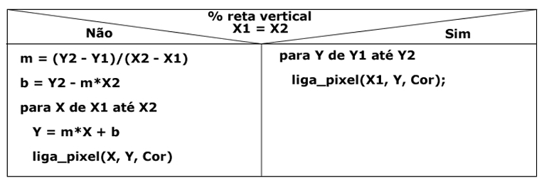
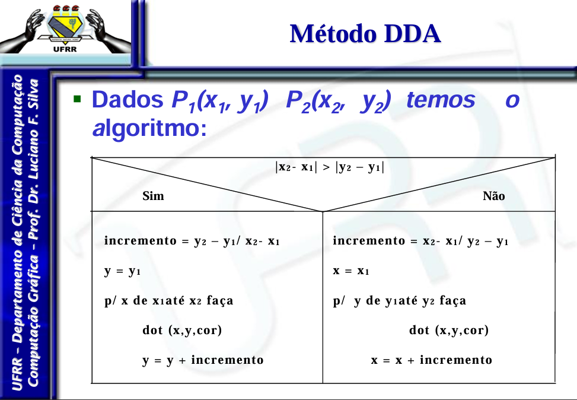
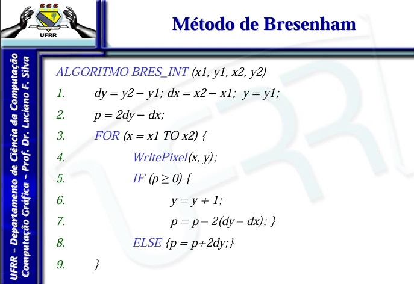

# Trabalho de rasterização de linhas

## Objetivo do programa

### Desenvolver um programa que permita desenhar retas por meio dos algoritmos:

- Analítico;
- DDA;
- Bresenham.

## Tecnologias utilizadas

### Linguagem de programação: 

Escolhi como linguagem para realizar esse trabalho o ```python``` a escolha foi devido a maior familiaridade com a linguem visando uma melhor implementação do código.

### Blibiotecas utilizadas:

Para esse codigo utilizei duas blibiotecas: 

- ```sys```: Dentro do codigo foi utilizada para encerrar o programa corretamente;

- ```pygame```: Essa foi usada pra conseguir demonstrar graficamente a implementação. Estava na duvida dentre ela e a mathplot, mas ela foi a escolhida visando facilitar futuras implementações no decorrer da disciplina.

## Implementação

Para essa implementação eu coloquei todos os três algoritimos em um único arquivo chamado linhas para facilitar vamos falar sobre cada um deles agora.

### Analítico: 

É uma função no codigo chamada ```analitico```, essa função tem 4 entradas ```x1```, ```y1```, ```x2``` e ```y2```. Para a realização do algoritimo eu fiz com referencia ao Slide disponibilizado pelo Professor durante as aulas da disciplina: 



Esse algoritimo tem uma falha é é quando o valor de ```x2``` é maior que ```y2``` ele não consegue lidar direito com o pixels. 

### DDA: 

Essa tabém é uma função no codigo que é chamada ```DDA```, essa função tem 4 entradas ```x1```, ```y1```, ```x2``` e ```y2```. Para a realização do algoritimo eu fiz com referencia ao Slide disponibilizado pelo Professor durante as aulas da disciplina: 



O DDA consegue melhorar o problema de descontinuidade do Analítico, mas ainda tem problemas como: 

- usar aritrimetica de float; 
- pode conter erros de arredondamento;
- Em grande escala ele pode ser lento.

### Bresenham: 

Este algoritimo foi implementado como uma função no codigo a sua chamada é ```bresenham```, assim como os outros metodos essa função tem 4 entradas ```x1```, ```y1```, ```x2``` e ```y2```. Para a realização do algoritimo eu fiz com referencia ao Slide disponibilizado pelo Professor durante as aulas da disciplina: 



Podemos classificar o Bresenham como o melhor dentre esses algoritimos mencionandos para rasterização de linhas e alguns dos pontos que corroboram com isso são: 

- Escolha entre dois valores de pixel vizinhos;
- Evita operações de arredondamente;
- Usa umincremento unitário;
- Método bastante veloz.

Essas são algumas das vantagens do Bresenham, ele consegue chagar nas lacunas que o DDA deixou em aberto fazendo ele uma exelente escolha para o problema de rasterização.

### Desenvolvimento: 

Durante minhas tentativas de realizar a codificação dos algoritimos eu sentir dificuldades em desenvolver o ```DDA``` e o ```Brasenham```, mas após analisar com calma o pseudo-códico que estava no slide conseguir faze-los depois de um tempo. Senti um pouco de dificuldade tambem na parte de realizar a visualização do algoritimos, tenter por meio do matplot porém depois de conversar com alguns colegas sobre o problema percebi que poderia enfrentar dificuldades futuras, a implementação da visualização das linhas não ficou da forma que eu pré concebi mas acredito que tenha ficado satisfatorio e bom pra exemplificar os calculos do algoritimo. 